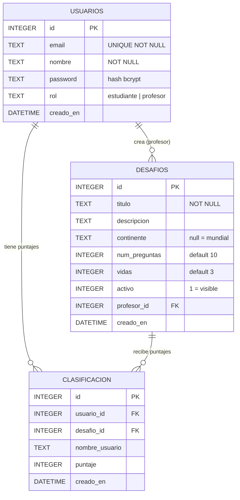

# Manual de Usuario — GeoDesafio

## Indice

1. [Descripcion general](#1-descripcion-general)
2. [Acceso al sistema](#2-acceso-al-sistema)
   - [Registro de cuenta nueva](#21-registro-de-cuenta-nueva)
   - [Inicio de sesion](#22-inicio-de-sesion)
   - [Cierre de sesion](#23-cierre-de-sesion)
3. [Rol Estudiante](#3-rol-estudiante)
   - [Pantalla de lobby](#31-pantalla-de-lobby)
   - [Iniciar un desafio](#32-iniciar-un-desafio)
   - [Como jugar](#33-como-jugar)
   - [Pantalla de fin de partida](#34-pantalla-de-fin-de-partida)
4. [Rol Profesor](#4-rol-profesor)
   - [Panel principal](#41-panel-principal)
   - [Crear un desafio](#42-crear-un-desafio)
   - [Editar un desafio](#43-editar-un-desafio)
   - [Eliminar un desafio](#44-eliminar-un-desafio)
   - [Activar o desactivar un desafio](#45-activar-o-desactivar-un-desafio)
5. [Diseno de base de datos](#5-diseno-de-base-de-datos)
   - [Diagrama logico](#51-diagrama-logico)
   - [Diccionario de datos](#52-diccionario-de-datos)
6. [Requisitos funcionales](#6-requisitos-funcionales)
7. [Requisitos no funcionales](#7-requisitos-no-funcionales)

---

## 1. Descripcion general

**GeoDesafio** es una aplicacion web de trivia geografica para uso educativo. Los estudiantes responden preguntas sobre capitales y continentes a partir de la bandera de cada pais. Los profesores crean y administran desafios con configuracion personalizada.

Caracteristicas principales:

- Dos roles de usuario: **Estudiante** y **Profesor**
- Preguntas generadas automaticamente desde la API de paises del mundo
- Sistema de vidas y puntaje por desafio
- Tabla de clasificacion (top 10) por desafio
- Soporte para filtrar preguntas por continente
- Interfaz animada y adaptada a dispositivos moviles

---

## 2. Acceso al sistema

### 2.1 Registro de cuenta nueva

1. Ingrese a la aplicacion. Si no tiene sesion iniciada, sera redirigido automaticamente a la pantalla `/auth`.
2. Haga clic en la pestana **Registrarse**.
3. Complete los campos:
   - **Nombre**: su nombre para mostrar en el juego.
   - **Email**: direccion de correo electronico (unica por cuenta).
   - **Contrasena**: minimo 6 caracteres.
   - **Rol**: seleccione **Estudiante** o **Profesor**.
4. Haga clic en **Crear cuenta**.

> Si el email ya esta registrado, el sistema mostrara un mensaje de error.

### 2.2 Inicio de sesion

1. En la pantalla `/auth`, seleccione la pestana **Iniciar sesion**.
2. Ingrese su email y contrasena.
3. Haga clic en **Entrar**.
4. El sistema lo redirigira segun su rol:
   - Estudiante → pantalla principal con lista de desafios
   - Profesor → panel de administracion

### 2.3 Cierre de sesion

- **Estudiantes:** haga clic en el boton **Salir** que aparece en la esquina superior derecha de la pantalla principal.
- **Profesores:** haga clic en el boton **Salir** en el encabezado del panel.

La sesion se cierra de forma segura y sera redirigido a `/auth`.

---

## 3. Rol Estudiante

### 3.1 Pantalla de lobby

Al iniciar sesion como estudiante vera la pantalla principal con:

- **Lista de desafios activos**: tarjetas que muestran el nombre del desafio, descripcion, cantidad de preguntas, vidas disponibles y continente (o "Mundial" si abarca todos).
- **Boton Jugar**: en cada tarjeta de desafio para iniciar la partida.

> Si no hay desafios activos, se muestra un aviso informativo.

### 3.2 Iniciar un desafio

1. En el lobby, encuentre el desafio que desea jugar.
2. Haga clic en el boton **Jugar** de esa tarjeta.
3. La pantalla de juego cargara automaticamente.

### 3.3 Como jugar

La pantalla de juego muestra:

| Elemento | Descripcion |
|----------|-------------|
| Corazones (vidas) | Indica cuantos errores puede cometer antes de que termine la partida |
| Estrellas (puntaje) | Numero de respuestas correctas acumuladas |
| Contador X/N | Pregunta actual sobre el total configurado |
| Barra de progreso | Muestra el avance visual de la partida |
| Bandera del pais | Imagen de la bandera del pais a identificar |
| Nombre del pais | Nombre del pais en ingles |
| Pregunta | Puede ser "Capital de [pais]" o "Continente de [pais]" |
| Campo de respuesta | Escriba su respuesta y presione la flecha o Enter |

**Reglas del juego:**
- Cada respuesta correcta suma **+1 punto** y avanza a la siguiente pregunta.
- Cada respuesta incorrecta consume **1 vida** y muestra la respuesta correcta brevemente antes de continuar.
- Las respuestas se comparan sin importar tildes ni mayusculas/minusculas.
- La partida termina cuando:
  - Se agotan todas las vidas, O
  - Se responden todas las preguntas configuradas en el desafio.

### 3.4 Pantalla de fin de partida

Al terminar la partida vera:

- Su puntaje final.
- Si su puntaje fue guardado exitosamente en la clasificacion.
- La **tabla de clasificacion** con los 10 mejores puntajes de ese desafio.
- Boton **Volver al lobby** para elegir otro desafio.

---

## 4. Rol Profesor

### 4.1 Panel principal

Al iniciar sesion como profesor vera el **Panel de administracion** con:

- Estadisticas rapidas: total de desafios creados, desafios activos y desafios inactivos.
- Lista de sus desafios con opciones para editar, eliminar y activar/desactivar.
- Boton **Nuevo desafio** para crear uno nuevo.

### 4.2 Crear un desafio

1. Haga clic en el boton **Nuevo desafio**.
2. Complete el formulario:

| Campo | Descripcion | Obligatorio |
|-------|-------------|-------------|
| Titulo | Nombre del desafio que veran los estudiantes | Si |
| Descripcion | Texto explicativo del desafio | No |
| Continente | Filtra las preguntas a un continente especifico. Deje vacio para preguntas de todo el mundo | No |
| Numero de preguntas | Cantidad de preguntas por partida (default: 10) | Si |
| Vidas | Cantidad de errores permitidos (default: 3) | Si |

3. Haga clic en **Crear desafio**.
4. El desafio se creara activo y aparecera en el lobby de los estudiantes.

**Continentes disponibles:** Africa, America, Asia, Europa, Oceania, Antartica.

### 4.3 Editar un desafio

1. En el panel, encuentre el desafio que desea modificar.
2. Haga clic en el icono de **editar** (lapiz).
3. Modifique los campos que necesite.
4. Haga clic en **Guardar cambios**.

> Solo puede editar los desafios que usted mismo creo.

### 4.4 Eliminar un desafio

1. En el panel, haga clic en el icono de **eliminar** (papelera) del desafio.
2. Se mostrara un dialogo de confirmacion.
3. Confirme la accion haciendo clic en **Eliminar**.

> Esta accion es irreversible. Los puntajes registrados en ese desafio tambien seran eliminados.

### 4.5 Activar o desactivar un desafio

- En la tarjeta del desafio en el panel, haga clic en el interruptor de estado.
- **Activo**: el desafio aparece en el lobby de los estudiantes.
- **Inactivo**: el desafio esta oculto para los estudiantes pero no se elimina.

---

## 5. Diseno de base de datos

### 5.1 Diagrama logico



### 5.2 Diccionario de datos

#### Tabla `usuarios`

Almacena todos los usuarios del sistema. El campo `rol` determina la interfaz que ve el usuario al iniciar sesion.

| Columna | Tipo | Restriccion | Descripcion |
|---------|------|-------------|-------------|
| `id` | INTEGER | PK, AUTO | Identificador unico del usuario |
| `email` | TEXT | UNIQUE, NOT NULL | Correo electronico (en minusculas) |
| `nombre` | TEXT | NOT NULL | Nombre para mostrar en el juego |
| `password` | TEXT | NOT NULL | Hash bcrypt de la contrasena |
| `rol` | TEXT | NOT NULL, DEFAULT 'estudiante' | Rol: `estudiante` o `profesor` |
| `creado_en` | DATETIME | DEFAULT NOW | Fecha y hora de registro |

#### Tabla `desafios`

Almacena los desafios creados por profesores. El campo `continente = NULL` indica que el desafio incluye paises de todos los continentes.

| Columna | Tipo | Restriccion | Descripcion |
|---------|------|-------------|-------------|
| `id` | INTEGER | PK, AUTO | Identificador unico del desafio |
| `titulo` | TEXT | NOT NULL | Nombre del desafio |
| `descripcion` | TEXT | | Descripcion opcional |
| `continente` | TEXT | | Filtro de continente (NULL = mundial) |
| `num_preguntas` | INTEGER | NOT NULL, DEFAULT 10 | Numero de preguntas por partida |
| `vidas` | INTEGER | NOT NULL, DEFAULT 3 | Vidas disponibles por partida |
| `activo` | INTEGER | NOT NULL, DEFAULT 1 | 1 = visible para estudiantes |
| `profesor_id` | INTEGER | FK → usuarios.id | Profesor dueno del desafio |
| `creado_en` | DATETIME | DEFAULT NOW | Fecha y hora de creacion |

#### Tabla `clasificacion`

Almacena un registro por cada partida completada. El campo `nombre_usuario` esta desnormalizado para evitar joins innecesarios en la lectura del leaderboard.

| Columna | Tipo | Restriccion | Descripcion |
|---------|------|-------------|-------------|
| `id` | INTEGER | PK, AUTO | Identificador unico del registro |
| `usuario_id` | INTEGER | FK → usuarios.id, NOT NULL | Jugador que completo la partida |
| `desafio_id` | INTEGER | FK → desafios.id, NOT NULL | Desafio jugado |
| `nombre_usuario` | TEXT | NOT NULL | Nombre del jugador (desnormalizado) |
| `puntaje` | INTEGER | NOT NULL | Respuestas correctas de la partida |
| `creado_en` | DATETIME | DEFAULT NOW | Fecha y hora de la partida |

#### Diagrama de flujo de datos

```
Registro / Login
      │
      ▼
┌─────────────┐
│  USUARIOS   │
│  (sesion    │
│   JWT)      │
└──────┬──────┘
       │
  rol = estudiante           rol = profesor
       │                          │
       ▼                          ▼
┌─────────────────┐     ┌──────────────────────┐
│ Lobby           │     │ Panel profesor        │
│ (DESAFIOS       │     │ (CRUD de DESAFIOS)    │
│  activos)       │     └──────────────────────┘
└──────┬──────────┘
       │ inicia partida
       ▼
┌─────────────────┐
│ Partida         │
│ PantallaJuego   │
│ (estado local)  │
└──────┬──────────┘
       │ fin de partida
       ▼
┌─────────────────┐
│ CLASIFICACION   │
│ (INSERT puntaje)│
└──────┬──────────┘
       │
       ▼
  Leaderboard top-10
  (SELECT por desafio_id)
```

---

## 6. Requisitos funcionales

| Codigo | Descripcion | Rol |
|--------|-------------|-----|
| RF-01 | El sistema permite registrar usuarios con email, nombre, contrasena y rol | Todos |
| RF-02 | El sistema permite iniciar y cerrar sesion | Todos |
| RF-03 | Las sesiones se mantienen mediante cookie JWT firmada | Todos |
| RF-04 | El estudiante ve la lista de desafios activos en el lobby | Estudiante |
| RF-05 | El estudiante puede iniciar cualquier desafio activo | Estudiante |
| RF-06 | El sistema genera preguntas aleatorias de capital o continente con la bandera del pais | Estudiante |
| RF-07 | Las respuestas correctas suman +1 punto; las incorrectas restan 1 vida | Estudiante |
| RF-08 | La partida termina al agotar las vidas o completar todas las preguntas | Estudiante |
| RF-09 | El puntaje se guarda en la base de datos al terminar la partida | Estudiante |
| RF-10 | Se muestra el top-10 del leaderboard del desafio al terminar la partida | Estudiante |
| RF-11 | El profesor accede a un panel de administracion exclusivo | Profesor |
| RF-12 | El profesor puede crear desafios con titulo, descripcion, continente, num. preguntas y vidas | Profesor |
| RF-13 | El profesor puede editar sus propios desafios | Profesor |
| RF-14 | El profesor puede eliminar sus propios desafios | Profesor |
| RF-15 | El profesor puede activar o desactivar sus desafios | Profesor |
| RF-16 | Los desafios pueden filtrarse por continente | Profesor |
| RF-17 | El sistema crea automaticamente un desafio global por defecto al iniciar | Sistema |

---

## 7. Requisitos no funcionales

| Codigo | Categoria | Descripcion | Implementacion |
|--------|-----------|-------------|----------------|
| RNF-01 | Seguridad | Las contrasenas no se almacenan en texto plano | Hash bcrypt con factor de coste 10 |
| RNF-02 | Seguridad | Los tokens de sesion no pueden ser falsificados | JWT firmado con `jose` y `JWT_SECRET` |
| RNF-03 | Seguridad | Un profesor solo puede modificar sus propios desafios | Validacion `profesor_id = sesion.id` en cada mutacion |
| RNF-04 | Rendimiento | Los datos de paises no se reconsultan en cada peticion | ISR de Next.js con revalidacion cada 3600 s |
| RNF-05 | Rendimiento | Carga inicial rapida mediante renderizado en servidor | Next.js Server Components |
| RNF-06 | Usabilidad | Retroalimentacion visual inmediata al responder | Animaciones con Framer Motion e input con colores |
| RNF-07 | Usabilidad | La interfaz es usable en dispositivos moviles | Diseno responsive con Tailwind CSS |
| RNF-08 | Disponibilidad | La aplicacion esta disponible de forma continua | Despliegue en red global de Vercel |
| RNF-09 | Mantenibilidad | El esquema de base de datos se migra automaticamente al iniciar | Logica de migracion en `lib/db.ts → initDB()` |
| RNF-10 | Integridad | Las relaciones entre tablas estan protegidas | Restricciones de clave foranea en SQLite |
