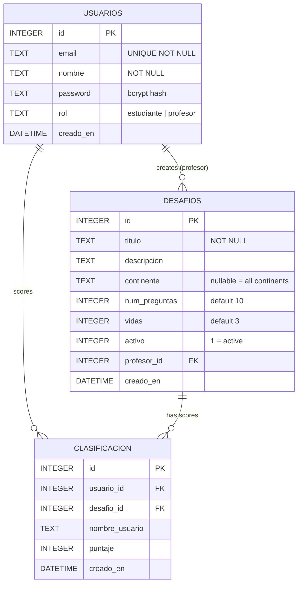

# GeoDesafio — Geography Challenge

A web-based geography quiz game where students answer questions about world capitals and continents, competing on per-challenge leaderboards. Teachers create and manage challenges through a dedicated dashboard.

**Live demo:** https://desafio-geografia.vercel.app

---

## Table of Contents

- [Features](#features)
- [Tech Stack](#tech-stack)
- [Getting Started](#getting-started)
- [Environment Variables](#environment-variables)
- [Deployment (Vercel)](#deployment-vercel)
- [Database Design](#database-design)
- [Architecture](#architecture)
- [Functional Requirements](#functional-requirements)
- [Non-Functional Requirements](#non-functional-requirements)

---

## Features

### Students
- Register and log in with email + password
- Browse active challenges from the lobby
- Play geography quizzes — identify capitals or continents from a country flag
- Earn points for every correct answer; lose lives for wrong ones
- See the top-10 leaderboard for each challenge after the game

### Teachers
- Separate teacher role — redirected to a dedicated dashboard on login
- Create challenges: set title, description, continent filter, number of questions, and number of lives
- Edit or delete any challenge they own
- Activate / deactivate challenges (inactive challenges are hidden from students)

---

## Tech Stack

| Layer | Technology |
|-------|-----------|
| Framework | Next.js 16 (App Router) |
| UI | React 19, Tailwind CSS 4 |
| Animations | Framer Motion 12 |
| Icons | Lucide React |
| Auth | JWT via `jose`, session cookie |
| Password hashing | bcryptjs |
| Database | libsql / SQLite (local) · Turso (production) |
| Country data | REST Countries API (cached 1 h) |
| Deployment | Vercel |

---

## Getting Started

### Prerequisites

- Node.js 20+
- pnpm (or npm / yarn)

### Install and run

```bash
git clone https://github.com/samuel1034/desafio-geografia.git
cd desafio-geografia
pnpm install
pnpm dev
```

Open [http://localhost:3000](http://localhost:3000).

The SQLite database file (`database.db`) is created automatically on first run — no migration step needed.

---

## Environment Variables

| Variable | Description | Example |
|----------|-------------|---------|
| `TURSO_DATABASE_URL` | Database URL. Use `file:database.db` for local SQLite | `file:database.db` |
| `TURSO_AUTH_TOKEN` | Turso auth token (leave empty for local file) | `eyJ...` |
| `JWT_SECRET` | Secret key for signing session JWTs | `change-me-in-production!` |

For local development, edit `.env.local`. For Vercel, add these in **Project > Settings > Environment Variables**.

---

## Deployment (Vercel)

1. Push the repository to GitHub.
2. Go to [vercel.com/new](https://vercel.com/new) and import the repo.
3. Add the environment variables listed above.
4. For a persistent database, create a free [Turso](https://turso.tech) database and set `TURSO_DATABASE_URL` + `TURSO_AUTH_TOKEN`.
5. Click **Deploy**.

> **Note:** The local `database.db` file is listed in `.vercelignore`. Always use Turso or another libsql-compatible remote database in production.

---

## Database Design

### Entity-Relationship Diagram



### Tables

#### `usuarios`
All registered users. Role (`rol`) determines which interface the user sees after login.

| Column | Type | Notes |
|--------|------|-------|
| `id` | INTEGER PK | Auto-increment |
| `email` | TEXT UNIQUE | Lowercased on insert |
| `nombre` | TEXT | Display name |
| `password` | TEXT | bcrypt hash (cost 10) |
| `rol` | TEXT | `estudiante` or `profesor` |
| `creado_en` | DATETIME | UTC timestamp |

#### `desafios`
Challenges created by teachers. `continente = NULL` covers all countries worldwide. `profesor_id = NULL` is the default system challenge.

| Column | Type | Notes |
|--------|------|-------|
| `id` | INTEGER PK | Auto-increment |
| `titulo` | TEXT NOT NULL | Challenge name |
| `descripcion` | TEXT | Optional description |
| `continente` | TEXT | Continent filter (nullable) |
| `num_preguntas` | INTEGER | Questions per game (default 10) |
| `vidas` | INTEGER | Lives per game (default 3) |
| `activo` | INTEGER | 1 = visible to students |
| `profesor_id` | INTEGER FK | References `usuarios.id` |
| `creado_en` | DATETIME | UTC timestamp |

#### `clasificacion`
One row per completed game. `nombre_usuario` is denormalized for fast leaderboard reads.

| Column | Type | Notes |
|--------|------|-------|
| `id` | INTEGER PK | Auto-increment |
| `usuario_id` | INTEGER FK | References `usuarios.id` |
| `desafio_id` | INTEGER FK | References `desafios.id` |
| `nombre_usuario` | TEXT | Player's display name |
| `puntaje` | INTEGER | Number of correct answers |
| `creado_en` | DATETIME | UTC timestamp |

---

## Architecture

```
┌─────────────────────────────────────────────────────────┐
│                        Browser                          │
│                                                         │
│   /auth          /             /profesor                │
│   (AuthForms)    (AppShell)    (ProfesorDashboard)      │
│                  └─ JuegoController (Client Component)  │
│                     ├─ LobbyDesafios                    │
│                     ├─ PantallaJuego                    │
│                     └─ PantallaGameOver                 │
└───────────────────────┬─────────────────────────────────┘
                        │  Next.js Server Actions
                        ▼
┌─────────────────────────────────────────────────────────┐
│               Next.js Server (Vercel)                   │
│                                                         │
│  lib/session.ts  →  JWT cookie (jose)                   │
│  lib/db.ts       →  @libsql/client                      │
│  lib/countries.ts→  REST Countries API (ISR 1 h)        │
└───────────────────────┬─────────────────────────────────┘
                        │
           ┌────────────┴────────────┐
           ▼                         ▼
     Turso / SQLite          restcountries.com/v3.1
```

**Data flow:**
1. Pages are Server Components — data fetched server-side before rendering.
2. Mutations (login, register, challenge CRUD, save score) use Server Actions.
3. The quiz itself is a Client Component that manages local game state.
4. Country data is cached at the edge for 1 hour via `next: { revalidate: 3600 }`.

---

## Functional Requirements

| # | Requirement | Status |
|---|-------------|--------|
| F-01 | Users can register with email, display name, password, and role | ✅ |
| F-02 | Users can log in and log out | ✅ |
| F-03 | Sessions persist via a signed JWT cookie | ✅ |
| F-04 | Students see the list of active challenges | ✅ |
| F-05 | Students can start a challenge and answer questions | ✅ |
| F-06 | Questions show the country flag and ask for capital or continent | ✅ |
| F-07 | Correct answers earn +1 point; wrong answers consume one life | ✅ |
| F-08 | A game ends when all lives are lost or all questions answered | ✅ |
| F-09 | Scores are saved to the leaderboard on game-over | ✅ |
| F-10 | Top-10 leaderboard per challenge is shown after each game | ✅ |
| F-11 | Teachers access a dedicated dashboard | ✅ |
| F-12 | Teachers create challenges with custom settings | ✅ |
| F-13 | Teachers edit their own challenges | ✅ |
| F-14 | Teachers delete their own challenges | ✅ |
| F-15 | Teachers activate / deactivate challenges | ✅ |
| F-16 | Challenges can be restricted to a specific continent | ✅ |
| F-17 | A default "Desafio Global" is seeded on first run | ✅ |

---

## Non-Functional Requirements

| # | Requirement | How it is met |
|---|-------------|---------------|
| NF-01 | Passwords never stored in plain text | bcrypt, cost factor 10 |
| NF-02 | Session tokens are signed and tamper-proof | JWT via `jose` + `JWT_SECRET` |
| NF-03 | Teachers can only modify their own challenges | `profesor_id = sesion.id` guard on every mutation |
| NF-04 | Country data is not re-fetched on every request | ISR revalidation every 3600 s |
| NF-05 | Fast initial page load via server-side rendering | Next.js Server Components |
| NF-06 | Immediate feedback on answers | Framer Motion + color-coded input state |
| NF-07 | Mobile-friendly layout | Tailwind CSS responsive utilities |
| NF-08 | High availability | Vercel global edge network |
| NF-09 | Schema auto-migrates on startup | `initDB()` migration in `lib/db.ts` |
| NF-10 | Referential integrity between tables | SQLite foreign key constraints |

---

## License

MIT
